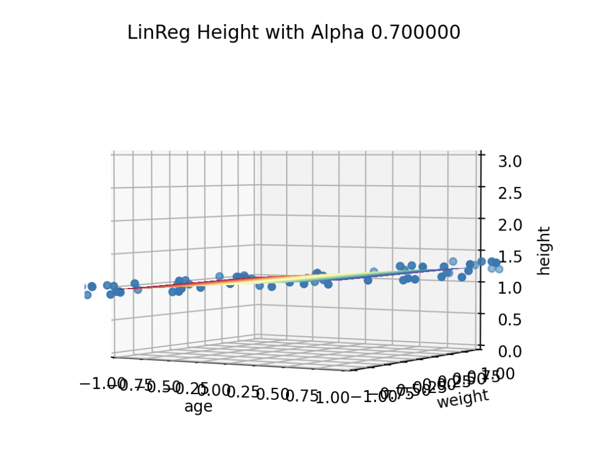

# LinearRegressionModelv1
This is a program of a linear regression model with gradient descent to predict the height (m) using age (years) and weights (kg) using data form CDC growth charts data.

## Description 🧐

This is a program that designed to train a linear regression model  with with gradient descent to predict the height (m) using age (years) and weights (kg) using data form CDC growth charts data. The data has been normalized to keep all the data in the same scale. 

The best fit I got for the model is when the learning rate (alpha) = 0.7 as the loss is the minimum. The hyperplane of the model is iullistrated in the figure below.



## Getting Started 🚀

### Dependencies

* Language/Version: python 3.9
* Libraries: sys, pandas, numpy, plt, mlines, Axes3D(mpl_toolkits.mplot3d)

### Executing program 👩🏻‍💻

* The program will be executed in the following format: 
```
$ python lr.py <data.csv> <output.csv>
```
* Example:
```
$ python lr.py dataset1.csv pla_output.csv
```

## Acknowledgments ❇️

* This program have been inspired by one of the projects in AI class.

